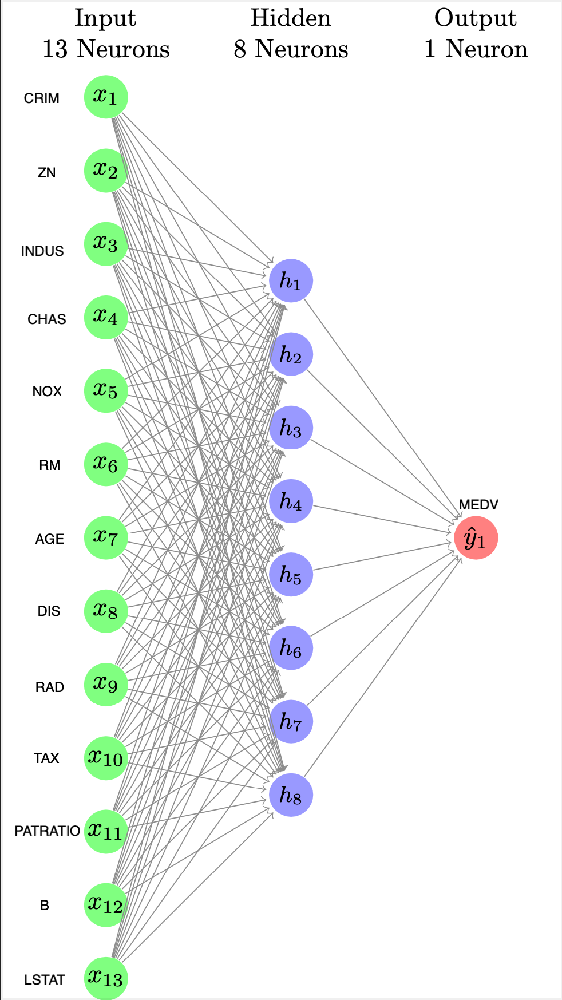

# house-price-prediction
Simple Neural Network (raw python, just using numpy) to predict house prices over a kaggle dataset (Boston House Prices).

### About the dataset
The dataset contains information regarding housing prices in Boston, Massachusetts. 
It encompasses various factors such as crime rate, nitric oxide concentration, and proportion of non-retail business acres per town, among others. 
This dataset is derived from the original [Boston House Prices dataset](https://www.kaggle.com/datasets/vikrishnan/boston-house-prices), which was collected in 1978 by Harrison, D. and Rubinfeld, D.L.
The goal of this dataset is to facilitate research and analysis in the field of housing market dynamics and predictive modeling. 

##### Content of the dataset
- CRIM per capita crime rate by town 
- ZN proportion of residential land zoned for lots over 25,000 sq.ft. 
- INDUS proportion of non-retail business acres per town 
- CHAS Charles River dummy variable (= 1 if tract bounds river; 0 otherwise) 
- NOX nitric oxides concentration (parts per 10 million) 
- RM average number of rooms per dwelling 
- AGE proportion of owner-occupied units built prior to 1940 
- DIS weighted distances to five Boston employment centres 
- RAD index of accessibility to radial highways 
- TAX full-value property-tax rate per $10,000 
- PTRATIO pupil-teacher ratio by town 
- B 1000(Bk - 0.63)^2 where Bk is the proportion of blacks by town (wtf)
- LSTAT % lower status of the population 
- MEDV Median value of owner-occupied homes in $1000's

### About the Neural-Network

<p float="left">
   
</p>

#### How to use

```python
from house-price-prediction-nn import NeuralNetwork, read_data
# Load the data.
X, y = read_data('housing.csv')

# Split in training and testing data.
X_train, y_train = X[:405], y[:405] # 405 Values
X_test, y_test = X[405:], y[405:] # 101 Values

# Create the NeuralNet.
neurons_input, neurons_hidden, neurons_output = 13, 8, 1
NN = NeuralNetwork(neurons_input, neurons_hidden, neurons_output)

# Train the NeuralNet.
NN.train(X_train, y_train, 5000, 0.001)

# Evaluate.
MSE = NN.evaluate(X_test, y_test) # MSE for mean squared error
RSE = np.sqrt(MSE) # RSE for root squared error
print(RSE)
```
------------------
#### Settings
- Learning rate: 0.001
- Epochs: 5000

##### Result
```shell
Root mean squared error: 5.11
```
-----------------
